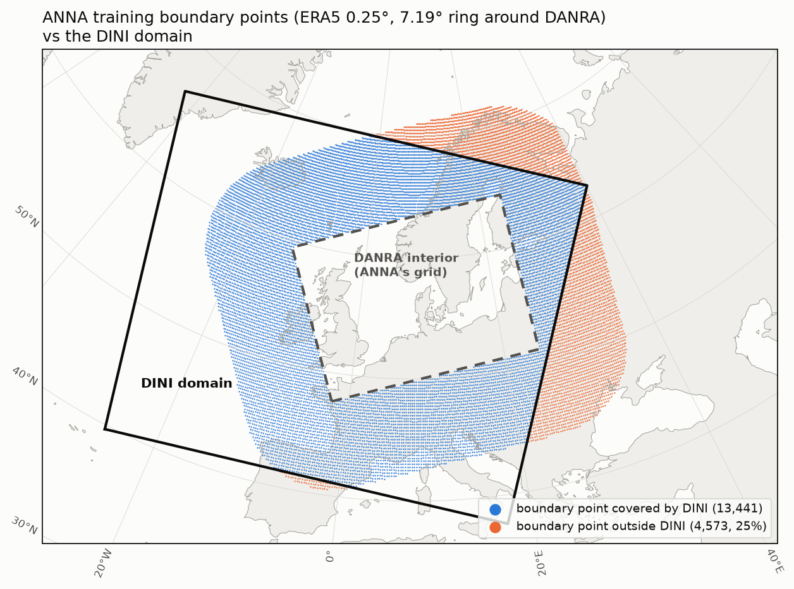

# Plan: run ANNA (gefion-1) with DINI initial and boundary conditions

## Context
The goal is to run ANNA end to end in its container, with the interior initial state and the boundary forcing both taken from DINI control runs at `s3://harmonie-zarr/dini/control/{YYYY-MM-DDTHHMMSSZ}/{single,pressure}_levels.zarr`.

Current state (branch `add-anna`, commit `dc0f545`): the image builds, but `entry.sh` stops after creating the inference dataset. There's no graph creation, no eval and no back-transform.

The only ANNA artifact, `s3://mlwm-artifacts/inference-artifacts/gefion-1.zip`, contains:
- `checkpoint.pkl`
- `configs/7deg_config.yaml`
- `configs/danra_model1_config.yaml`
- `stats/danra_model1_config.stats.zarr`

It has **no boundary datastore config or stats**, because `_find_datastore_paths` (`src/mlwm/build_inference_artifact.py`) skips `datastore_boundary`.

## Training provenance (recovered)
- **Run:** wandb [`jo-research-team/neural_lam/n0o7jw5f`](https://wandb.ai/jo-research-team/neural_lam/runs/n0o7jw5f) (`train-hi_lam-2x300-02_27_15-4034`, Gefion, 80 epochs from scratch). The run [`hfzfhiha`](https://wandb.ai/jo-research-team/neural_lam/runs/hfzfhiha) is a different one: a 3-epoch `7deg_rect_hi4` fine-tune. Neither logged the boundary config.
- **Checkpoint hyperparameters:**
  - `hi_lam`, graph `7deg_rect_hi3`, `hidden_dim=300`, `hidden_dim_grid=150`, `time_delta_enc_dim=32`, `dynamic_time_deltas=True`, `processor_layers=2`
  - 1 past and 1 future forcing/boundary step
  - input widths: interior 127, boundary 272
- **Code:** [`joeloskarsson/neural-lam-dev`](https://github.com/joeloskarsson/neural-lam-dev), commit **`e58e334c`** (2025-02-27, "Add --dynamic_time_deltas flag", `research` branch), from the run's `wandb-metadata.json`. (An earlier version of this plan said `e7d11c9`; that was the commit of the other run, `hfzfhiha`.) Training environment (run `requirements.txt`): torch 2.6.0, pytorch-lightning 2.5.0.post0, mllam-data-prep 0.5.0 (sadamov fork), weather-model-graphs 0.2.0, xarray 2025.1.2, dask 2025.1.0, zarr 2.18.3.
- **Published paper checkpoint:** neural-lam-dev's README links [Zenodo 15131838](https://zenodo.org/records/15131838) with a `danra_model.ckpt` (281 MB, 2025-04). It may be a later fine-tune of this model; compare it against gefion-1 at some point.
- **Configs in that repo** (`research` branch, `scripts/`):
  - `danra_era5_config.yaml` is **the boundary config**. It matches the `MDPDatastore` pickled in `checkpoint.pkl` field for field:
    - ERA5 at PT6H
    - `domain_cropping` with a 7.19° margin around the DANRA interior, interior points excluded, giving 18014 points
    - 58 forcing features: `era5_sl` (mslp, t2m, u10, v10, sp, plus derived toa_radiation and hour/day sin/cos) and `era5_pl` (z, t, q, u, v, w at 100/200/400/600/700/850/925/1000 hPa)
    - 2 static features (`land_sea_mask`, `geopotential_at_surface`)
    - PlateCarree projection
  - `danra_model_config_era5.yaml` equals the artifact's `7deg_config.yaml`, and `danra_interior_config.yaml` is the interior config.
- **ERA5 source** (`scripts/era_download.py`): WeatherBench2 `gs://weatherbench2/datasets/era5/1959-2022-6h-1440x721.zarr` (public), subset by lon/lat box and levels.
- **Graph** (`scripts/danra_build_graphs.sh`): `python -m neural_lam.build_rectangular_graph --config_path <nl config> --mesh_node_distance 12500 --archetype hierarchical --max_num_levels 3 --graph_name 7deg_rect_hi3`
- **Eval** (`scripts/danra_eval.sh`): `train_model --hidden_dim 300 --hidden_dim_grid 150 --time_delta_enc_dim 32 --model hi_lam --processor_layers 2 --graph_name ... --load ... --eval test`, plus `--save_eval_to_zarr_path` (available on `research`).
- **Dependency conflict** (resolved in step 2):
  - The old pin `khintz/neural-lam@dev/first-inference-image` **couldn't load ANNA**: it has no `hidden_dim_grid`, `time_delta_enc_dim`, boundary steps or `graph_name`.
  - `research` requires `sadamov/mllam-data-prep@building-ml-lams` (`latlon-domain-crop` extra), while `create_inference_dataset.py` used `leifdenby/mllam-data-prep@feat/inference-cli-args`.
- **Still missing:** the boundary train stats and the exact 18014 boundary lat/lon. Both are only on Gefion (`/dcai/projects/cu_0003/data/sources/era5/era_danra_model1_subset.zarr`), but both can be reproduced from WB2 ERA5, the DANRA grid and the config above.

## DINI facts (probed on `2026-09-26T180000Z`)
- 2 km Lambert, 1906×1606, hourly T+0..T+36, lat 37.7–69.9°N.
- `single_levels`: has every interior surface state variable (`pres_seasurface t2m u10m v10m pres0m lwavr0m swavr0m`), plus `lsm` and `orography`.
- `pressure_levels`: `z t r u v tw` on 14 levels, including all 8 needed. The `pressure` coordinate has no units attribute.
  - `tw` is **geometric vertical velocity** w in m/s (`paramId 260238`). ERA5 `vertical_velocity` is pressure vertical velocity ω in Pa/s, so it has to be converted: ω ≈ −ρ·g·w, with ρ = p / (R_d·T_v).
  - `r` is in **%**. DANRA/training uses a fraction (clamped to [0, 1]), so divide by 100.
  - Verified against DANRA v0.5.0 and the `gefion-1` train stats:
    - DANRA `tw` is labelled "Vertical velocity", `upward_air_velocity`, m/s. Its train std per level (0.046 @100, 0.093 @400, 0.112 @850, 0.065 @1000 hPa) matches DINI `tw` (0.046, 0.111, 0.134, 0.072 on 2026-09-27T00Z), so it's the same quantity and goes into the interior unchanged. DANRA has no separate `w`.
    - DANRA `r` is **mislabelled** as `%` but stored as a fraction (train means 0.04–0.79). DINI `r` really is in % (means 2.6–78, max 100).
- `height_levels`: `r t u v`.
- **No specific humidity.** q can be derived from r, t and p.

## Decisions
- Interior: regrid DINI onto the DANRA grid.
- Initial states: T+0 and T+3h of the same DINI run, so the first ANNA prediction is valid at T+6h.
- Vertical velocity: derive ERA5-style ω (Pa/s) from DINI `tw` (m/s). This replaces the earlier idea of filling it with the train mean; DINI already has it.

## Steps

### 1. Boundary datastore configs (do this first) — DONE
Status: implemented in `configurations/ANNA/configs/` and checked by `configurations/ANNA/tests/test_boundary_configs.py` (14 tests). The ERA5 boundary feature order was also checked against the order stored in the gefion-1 checkpoint, and it matches exactly (58 forcing + 2 static). Changes from the original plan are described below.

Learned while implementing (mllam-data-prep `sadamov/building-ml-lams`):
- `coord_ranges` can't have start == end, so the IFS/DINI configs have no `coord_ranges` (one cycle per store) and wide splits (2000–2100). They're used as-is at run time, with only input `path`s set.
- Input `dims` is a superset check: each variable's dims must be a subset of the list, so 2D statics are fine.
- If the `level` coordinate has a `units` attr, it must be exactly `"hPa"`.
- Cropping works on the unit sphere, so the longitude convention doesn't matter, but the coords must be named `latitude`/`longitude`. `interior_dataset_config_path` is resolved relative to the CWD, and cropping builds the full interior dataset.
- neural-lam resolves datastore paths relative to the neural-lam config file. `overload_stats_path` is a datastore *config*: neural-lam opens `<name>.zarr` next to it, or *creates the full dataset* if that zarr is missing (see step 3).

Original step description:
These configs define exactly which fields, levels, grid and dims each boundary source must provide. They're the spec to extend the GRIB→zarr conversion tool against for IFS GRIB files. Put them in `configurations/ANNA/configs/`:
- **`era_7deg_model1_config.yaml`** is the training boundary config, recovered from the checkpoint and matching `neural-lam-dev@research:scripts/danra_era5_config.yaml`. Keep the training time range and splits: it's the reference that defines the feature order and the ERA5 train stats (`overload_stats_path` target), and step 3 uses it to reproduce the stats. Paths get rewritten to `era5.zarr` + `danra_model1_config.yaml`.
- **`ifs_7deg_model1_config.yaml`** is the operational IFS boundary, adapted from `danra_ifs_config.yaml`:
  - inputs `ifs_sl` / `ifs_pl` with the variables and levels in the table in step 9
  - dims `[time, prediction_timedelta, longitude, latitude(, level)]`, mapped to `analysis_time` / `elapsed_forecast_duration`
  - `domain_cropping` 7.19° around `danra_model1_config.yaml`
  - statics (`land_sea_mask`, `geopotential_at_surface`) from IFS itself rather than ERA5, so the operational setup has one source. Keep the ERA5 `era_static` input as a commented alternative.
  - Placeholder `path: ifs.zarr`; `create_inference_dataset.py` overrides it at run time.
  - A header comment listing, per field, the IFS shortName/paramId, units and the zarr variable/dim names the converter must write. This is the contract for the converter.
- **`dini_7deg_model1_config.yaml`** is the DINI boundary. As implemented, `regrid_dini.py` (step 4) writes `boundary.zarr` in **exactly the IFS contract layout** (regular 0.25° lat/lon box, `time` × `prediction_timedelta`, ERA5 names). This config is therefore the IFS config with a different path and input names, and it uses the same `domain_cropping`, so there's one boundary format to get right.
- **neural-lam configs** `7deg_config_{era5,ifs,dini}.yaml`: `datastore` = `danra_model1_config.yaml`, `datastore_boundary` = the matching boundary config, and for `ifs`/`dini`, `overload_stats_path: era_7deg_model1_config.yaml`.
- **Validation:** load each config with the pinned mdp (step 2). For the IFS config, also build a tiny synthetic `ifs.zarr` with the expected variable/dim names, run `mdp.create_dataset`, and check it gives 58 forcing + 2 static features, in the same order as the ERA5 config (feature order must match the checkpoint).

### 2. Switch neural-lam and mdp to the training lineage (`configurations/ANNA/pyproject.toml`) — DONE
Status: the gefion-1 checkpoint loads strictly (16,666,855 parameters) with the pinned stack, and a one-step `train_model --eval test` runs end to end and writes finite predictions to zarr. This was checked on synthetic data with `dev-utils/check_checkpoint_compat.py --run-eval`.

Pins (in `configurations/ANNA/pyproject.toml`):
- **neural-lam** → `joeloskarsson/neural-lam-dev@a44d432e` (`research`, 2025-08-22). It contains the training commit `e58e334c`, the fix after it (`8a38350e`), forecast-format boundary loading (`fb820e2a`, needed for IFS) and the DANRA checkpoint dependency pins (`2feaf91d`). Later `research` commits add git submodule entries without a `.gitmodules` URL, which breaks installing from git, and they only change plotting code in `neural_lam/`. `a44d432e` also adds the paper's `scripts/ifs_download.py` and `scripts/interp_na_ifs.py`, a reference for the IFS converter.
- **mllam-data-prep** → exactly the training version, `sadamov/mllam-data-prep@dd9af481` (`building-ml-lams`, mdp 0.5.0 based), via `[tool.uv] override-dependencies`, because neural-lam-dev pins it by URL. It has `domain_cropping` and `lead_time`.
  - **Not** the planned leifdenby `feat/inference-cli-args` (mdp 0.7) + cherry-picked `lead_time`. That combination builds, but mdp 0.7 keeps `latitude`/`longitude` as 1D dim coords for regular lat/lon grids instead of per-`grid_index` coords, and neural-lam-dev's `get_lat_lon` fails on the boundary datastore.
  - Consequence for step 5: sadamov's `create_dataset()` has no `ds_stats` argument, so `create_inference_dataset.py` must merge the training stats into the dataset itself.
- **zarr** `>=2.18,<3` (training used 2.18.3): neural-lam-dev writes eval output with a zarr v2-style `numcodecs.Blosc` compressor, which zarr 3 rejects. xarray 2025.3 also doesn't support the zarr 3.1 dtype API.
- **dask** floor lowered to `>=2025.3.0` (neural-lam-dev pins `dask~=2025.3.0`, `xarray~=2025.3.1`, `numpy<2`).

Learned while implementing (needed in later steps):
- **Sanitise the checkpoint** (`dev-utils/sanitize_checkpoint.py`, step 3). `hyper_parameters["datastore_boundary"]` is the pickled training datastore, with lazy zarr v2 arrays pointing at `/dcai`. It can't be unpickled with zarr 3 and is useless anyway, so drop it and keep `args` and `config`.
- **`TORCH_FORCE_NO_WEIGHTS_ONLY_LOAD=1`** must be set in `entry.sh`. Lightning's `load_from_checkpoint` uses torch's default `weights_only` (True since torch 2.6), and the checkpoint holds `argparse.Namespace`/`NeuralLAMConfig` objects.
- **`--dynamic_time_deltas`** must be passed to `train_model` (it's a `store_true` flag, and ANNA was trained with it on). Also pass `--num_workers >= 1` (neural-lam-dev uses `persistent_workers`).
- Use **`WANDB_MODE=offline`** (with `WANDB_DIR` in the workdir), not `wandb disabled`. With wandb disabled, `on_test_epoch_end` crashes saving metric plots into a non-existent run dir. Offline mode sends nothing.
- neural-lam-dev's `main()` is wrapped in `@logger.catch`: **exceptions are logged but the exit code is 0**. `entry.sh` must check that the output zarr exists rather than rely on the exit code.
- **Never write mdp configs with sorted keys.** `Config.to_yaml_file()` sorts keys by default, which reorders inputs and variables and so changes the feature order the checkpoint expects. Use `to_yaml_file(..., sort_keys=False)` (applies to `create_inference_dataset.py`, step 5).
- Eval output format: `state(start_time, elapsed_forecast_duration, state_feature, x, y)`. Check that `recreate_inputs` (step 6) accepts it.
- In the container, torch is constrained to the base image's version (2.10), whereas locally torch 2.14 was used with torch-geometric 2.3.1. Re-check in the container build (step 6).

Original step description:
- `neural-lam` → `joeloskarsson/neural-lam-dev@research`, pinned to a sha that includes `e7d11c9`.
- `mllam-data-prep` → a branch with both `domain_cropping` (sadamov `building-ml-lams`) and the inference CLI args (leifdenby `feat/inference-cli-args`). Check whether they can be merged, or whether one branch already has both. **This is the riskiest dependency step.** Step 1's configs can be written in parallel, but their validation needs this step.

### 3. Complete the artifact locally (no upload for now) — DONE (with placeholder boundary stats)
Status:
- `src/mlwm/build_inference_artifact.py` now packages `datastore_boundary`, including its stats. It also rewrites **every** datastore `config_path` to the packaged file; the single `datastore` case previously kept absolute `/dcai` paths. Covered by `src/mlwm/tests/test_build_inference_artifact.py`.
- `dev-utils/assemble_artifact.py --gefion-1-zip … --boundary-stats …` builds `configurations/ANNA/inference_artifact/` (gitignored):
  - `checkpoint.pkl`, sanitised
  - `configs/`: the repo configs, plus the originals under `configs/gefion-1/`
  - `configs/era_7deg_model1_config.zarr`, the stats datastore
  - `stats/{danra,era_7deg}_model1_config.stats.zarr`
  - `grids/era_7deg_model1_config.grid.zarr`, the 18014 boundary points recovered from the checkpoint. They're identical to the recovery done with Kasper's actual subset file.
  - `artifact.yaml` with provenance, including whether the boundary stats are a placeholder.

  It checks that neural-lam loads the stats datastore. `check_checkpoint_compat.py --run-eval` passes with the artifact's checkpoint and configs.
- Assembled for now with **placeholder boundary stats**: weather fields from 3 days of ERA5 (2010-01-01..03), derived features over the full training split, statics exact. Re-run the assembly with the exact stats from the server run (`compute_era5_boundary_stats.py`) when they're available.
- For the boundary, **neural-lam only uses `{forcing,static}__train__{mean,std}`** (`MDPDatastore.get_standardization_dataarray`); `diff_*` is only used for the interior `state`. So the ERA5 `diff_*` stats (and their second-difference quirk) don't affect inference.
- `Containerfile`: `ARG ARTIFACT_SOURCE=local` (default) copies `inference_artifact/`, and `s3` keeps the old download. `build_image.sh` only requires AWS credentials for `s3`, and warns if the local artifact uses placeholder stats. `.dockerignore` keeps `.venv` etc. out of the build context. **Not built yet**; that's the step 6 verification.

Original step description:
- Fix `_find_datastore_paths` so it includes `datastore_boundary`, and add a test in `src/mlwm/tests/`. That way a future re-build on Gefion is complete.
- Assemble a local artifact directory `configurations/ANNA/inference_artifact/` (gitignored) from `gefion-1.zip` plus:
  - the step 1 configs (`configs/era_7deg_model1_config.yaml`, `ifs_…`, `dini_…`, and the neural-lam config variants)
  - the checkpoint, sanitised with `dev-utils/sanitize_checkpoint.py` (see step 2)
  - `stats/era_7deg_model1_config.stats.zarr` and `grids/era_7deg_model1_config.grid.zarr` (boundary lat/lon)
- **ERA5 stats datastore zarr.** `overload_stats_path` makes neural-lam open `era_7deg_model1_config.zarr` next to the configs. It must contain at least `splits` (train/val/test), the `forcing_feature`/`static_feature` coordinates, and `{forcing,static}__train__{mean,std}` plus `forcing__train__diff_{mean,std}`. The zarr must be newer than the config, or neural-lam logs a warning. If it's missing, neural-lam tries to build the full 2000–2020 ERA5 dataset.
- **Checked Kasper's `ablation-studies.tgz`** (a local copy of the ablation-studies directory):
  - Its `configs/{danra_model1,era_7deg_model1}_config.zarr` are **2-day test datastores** (2010-01-01..03, one-day "train" split, zarr v3). Their stats are *not* the training stats: the interior ones differ from the gefion-1 artifact stats, e.g. mslp mean 100,647 vs 101,308 Pa. Don't use them.
  - `era_subset/era_danra_model1_subset.zarr` also covers only 2010-01-01..03. It does have the exact training ERA5 grid, 187 lat × 267 lon at 0.25° (lat 79.25–32.75, lon 0–359.75 wrapping around Greenwich).
  - With that grid and the `grid_index` values kept in the checkpoint's pickled boundary datastore (stacked `[longitude, latitude]`), the **exact 18014 boundary points are recovered**: lat 40.50–71.50, lon −26.25–39.50. That's the boundary lat/lon part of this step done.
- **Boundary stats: recompute from WeatherBench2** (the Gefion training datastore is no longer accessible) with `dev-utils/compute_era5_boundary_stats.py`, to be run on a server with good bandwidth to GCS.
  - It replicates the training mdp (`sadamov@dd9af481`) exactly: stats are computed **before cropping**, i.e. over the whole ERA5 subset box (187 × 267 points), and **`diff_std` is the std of second differences**, because `calc_stats()` overwrites `ds` when applying `diff_` ops.
  - It streams restartable blocks with float64 (count, mean, M2) accumulators.
  - Validated two ways:
    1. On the 2-day subset against Kasper's mdp-built test datastore: all forcing stats match to about 1e-13 relative, and the statics to about 1e-7 (mdp keeps them in float32).
    2. The WB2 box selection is bit-identical to `era_danra_model1_subset.zarr` at 2010-01-01T00.
  - Cost: WB2 has one global chunk per time step, so there are about 345 MB of reads per step, about 9 TB for the full split (about 27,500 steps). `--block-stride N` gives approximate stats from every N-th block. Fallback `src/mlwm/recompute_boundary_stats.py`:
  - Run mdp on WB2 ERA5 with the recovered config over the train split (2000-01-01..2018-10-29, 6-hourly).
  - Assert 18014 grid points.
- Add a small script (e.g. `configurations/ANNA/dev-utils/assemble_artifact.sh`) that downloads `gefion-1.zip` and adds the extra files, so the directory can be reproduced.
- `Containerfile`: add `ARG ARTIFACT_SOURCE=local`. When `local`, `COPY inference_artifact/` into the image instead of the S3 download. Keep the S3 path for later, when the completed artifact is uploaded (e.g. as `gefion-2.zip`).

### 4. `src/regrid_dini.py` (new, runs before `create_inference_dataset.py`)
Implemented as `src/regrid_dini.py`, with two commands:
- `create-danra-grid` caches DANRA's grid and statics. `assemble_artifact.py` now writes them to `grids/danra_model1_config.grid.zarr`; the cached statics equal the DANRA static training stats exactly.
- `regrid --dini-root … --danra-grid … --forecast-duration … --output …` writes `interior_{single,pressure}_levels.zarr` and `boundary.zarr`.

Unit tests are in `tests/test_regrid_dini.py`.

Findings from the data that shaped it (don't trust the metadata labels):
- **Winds.** DINI *and* DANRA u/v are **grid-relative**. DINI is labelled `eastward_wind`/`northward_wind`, and every variable in both carries `uvRelativeToGrid: 1`, so neither label helps. Checked with geostrophic balance at 500 hPa: DINI stored wind vs grid-relative geostrophic median −1.2°, no dependence on the grid rotation; DANRA −6° vs −27° if treated as earth-relative. The two Lambert grids are rotated differently (DINI centred on 8°W, DANRA on 25°E), so winds are rotated DINI grid → earth on the DINI grid, interpolated, then earth → DANRA grid (interior) or kept earth-relative (boundary, as ERA5/IFS).
- **`orography`.** DINI is surface altitude (m); DANRA is surface **geopotential** (m²/s², train mean 1105). The interior statics come from DANRA itself; the boundary `geopotential_at_surface` = DINI orography × g.
- **`lwavr0m`** is **net** longwave in both (DINI mean −52, DANRA train mean −58 W/m²), even though DINI's label says downwelling. `swavr0m` is the same HARMONIE parameter (`swavr`) in both.
- **`r`** is % in DINI and a fraction in DANRA.
- **Boundary derived fields:** `q` uses the IFS/ERA5 mixed-phase saturation vapour pressure. `ω = −ρ g w` is hydrostatic, with virtual temperature.
- **DINI chunks** are one time × one level × the full field, so each field read is about 24 MB (float64).
- **25% of the training boundary points (4,573 of 18,014) are outside DINI.** Only 733 are north of 69.9°N; 2,180 are east of 30°E, reaching south to 40.5°N, because DINI's Lambert grid (centred on 8°W) tilts westward at its eastern edge. With `--outside-domain nearest` (the default) they take the value of the nearest DINI edge point, and the count is recorded in the output attrs; `error` refuses instead. This makes the DINI-only boundary a rough approximation over a quarter of the ring, so **IFS (step 9), or DINI blended with IFS outside the DINI domain, is the better boundary source**. **Decision (user):** use the DINI boundary with nearest-edge fill for now, so the pipeline runs end to end, and switch the default to IFS once the IFS zarr exists.

  

  *The 18,014 boundary points ANNA was trained with (the ERA5 0.25° ring, 7.19° around the DANRA interior), blue where DINI covers them and orange where it doesn't. The solid outline is the DINI domain and the dashed one the DANRA interior. Most uncovered points are east of DINI (Baltic states to the Black Sea, eastern Finland) and north of it (northern Norway, Kola, Barents Sea), with a thin strip along DINI's southern edge over Spain. Made with `dev-utils/plot_boundary_coverage.py`.*
- **Boundary box east edge = 39.5°E exactly.** With 40.0°E, cropping gave 18,063 points (49 not used in training). Fixed in the regridder and in the IFS contract.
- **Smoothing before sampling the boundary** (`--boundary-smoothing-km`, default 25 km = 13 × 13 DINI cells). Point samples of 2 km DINI kept small-scale vertical velocity: normalised std 3–4.6 at 850–1000 hPa, against 0.25° ERA5 stats. With smoothing these are in range.

Verified on DINI 2026-09-26T18Z (`--forecast-duration PT3H`):
- winds vs geostrophic at 700 hPa: interior (DANRA grid-relative) median −2.0°, boundary (earth-relative) −0.1°;
- normalised with the training stats, all features have |mean| < 2 and std of roughly 1. The exceptions are night-time `swavr0m`, and q/upper-level T/z around +1.8, which is expected against the January placeholder stats;
- the outputs load NaN-free through `danra_model1_config.yaml` (55 state features, 589 × 789 points) and `dini_7deg_model1_config.yaml` (58 forcing features, in the ERA5 stats order). The cropped boundary points are **identical to the 18,014 training points**;
- regridding takes about 2 min per time step from a laptop; most of that is reading DINI from S3.

Original step description:
- **Interior:** DINI → DANRA grid (bilinear via lat/lon, DANRA grid cached in the image), every 3 h, DANRA names, `pressure` units set to hPa, and `r` converted from % to a fraction. `tw` passes through unchanged (verified to be the same quantity). For the other variables, compare DINI magnitudes against the train stats rather than trusting the unit labels. Writes `interior.zarr`.
- **Boundary:** DINI → a regular 0.25° lat/lon box (lat 40.0–72.0, lon −27.0–39.5), every 6 h, following the IFS contract in `configs/ifs_7deg_model1_config.yaml`. `domain_cropping` in `dini_7deg_model1_config.yaml` then selects the boundary points. ERA5 names:
  - `pres_seasurface`→`mean_sea_level_pressure`, `t2m`→`2m_temperature`, `u10m/v10m`→`10m_{u,v}_component_of_wind`, `pres0m`→`surface_pressure`
  - `z t u v`→`geopotential temperature {u,v}_component_of_wind`, with `pressure`→`level`
  - `specific_humidity` derived from `r/100, t, p`
  - `vertical_velocity` (ω, Pa/s) = −(p / (R_d·T_v))·g·`tw`, with T_v from `t` and q
  - `lsm`→`land_sea_mask`, `orography`×g→`geopotential_at_surface`
  - Check the ERA5-side units against WB2 (e.g. `geopotential` in m²/s² vs DINI `z`).
  - Writes `boundary.zarr`.
- Fail if any boundary point falls outside the DINI domain. This **will** trip on the northern edge (boundary up to 71.5°N, DINI up to 69.9°N); see Open issues.

### 5. `src/create_inference_dataset.py` — IMPLEMENTED, final check pending
Rewritten as an ANNA-specific CLI: `--artifact --interior-dir --boundary --boundary-source {dini,ifs} --analysis-time --forecast-duration --workdir`. It writes `danra_model1_config.{yaml,zarr}`, `{dini,ifs}_7deg_model1_config.{yaml,zarr}` and `config.yaml` (neural-lam) to the workdir:
- **Interior:** inputs come from the regridded zarrs. The time range runs from the analysis time to analysis + duration + 2 steps, with train/val/test all equal to it. There's no `compute_statistics`; the DANRA *training* stats from the artifact are merged in (statistics variables only, the feature metadata describes the inference data).
- **Boundary:** the config is used as-is with the input path set, and cropping points at the inference interior config by absolute path. The script checks that the lead times reach analysis + duration + 6 h.
- **neural-lam config:** datastores in the workdir, and `overload_stats_path` pointing at the artifact's ERA5 stats datastore by absolute path.

Checked on DINI 2026-09-26T18Z (before the DINI zarr source disappeared, see below):
- the interior datastore has 55/5/2 features on 464,721 points, the boundary 58/2 on the **18,014 training points**;
- both load in neural-lam (`load_config_and_datastores`), the boundary as forecast data;
- boundary standardisation == ERA5 training stats (overload works), and interior == DANRA training stats.
- **Still to check:** building the neural-lam test sample (`WeatherDataModule`, one forecast step). This needs a fresh DINI run with ≥ 5 interior steps.

Learned (for step 6):
- **Init-time filtering:** neural-lam's eval sampler only supports init times 00/12 UTC, and `train_model` defaults to `--eval_init_times 0 12`. Pass an empty `--eval_init_times` to disable the filter. With the datastore covering exactly one forecast there is exactly one sample.
- **`--ar_steps_eval` = duration / 3 h − 1.** The initial states are at T+0 and T+3 h, so predictions run from T+6 h to T+duration. The script logs the value. The minimum duration is 6 h.
- **The interior needs two extra steps**, T+0 … T+duration+6 h. One is for `num_future_forcing_steps=1`, and one more because `WeatherDataset.__len__` counts `n_times − (2 + ar_steps) − future_forcing_steps`, one step more conservative than the data a sample uses. The boundary needs T+duration+6 h. **So a 36 h DINI run supports forecasts up to 30 h.**
- `regrid_dini.py` now sets correct `units` attrs (relative humidity is `1`, a fraction), and rounds the number of boundary steps up.

**DINI data source:** `s3://harmonie-zarr/dini/control/` was empty as of 2026-10-05, though the bucket still exists and other buckets are readable. `s3://zarr-from-dini/` only has raw DINI GRIB from 2025-02. The current location and retention of the DINI zarrs needs finding out.

Original step description:
- `FP_TRAINING_CONFIG` → `inference_artifact/configs/7deg_config.yaml` (the current `config.yaml` doesn't exist).
- Also rewrite `datastore_boundary.config_path`, not just `datastore`/`datastores`.
- The interior keeps its PT3H `coord_ranges`. The boundary configs (IFS/DINI) are used as-is with only the input paths set. Make sure the boundary store's lead times extend one boundary step past the forecast (`num_future_boundary_steps=1`).
- For cropping, set `domain_cropping.interior_dataset_config_path` to the inference interior config (relative to CWD), so cropping uses the small inference interior dataset, not full DANRA.
- Remove the unused `drop_time_inputs`.
- Merge the training stats into the created dataset in the script. The pinned mdp's `create_dataset()` has no `ds_stats` argument (step 2).
- Write every config with `to_yaml_file(..., sort_keys=False)`, or the feature order changes (step 2).

### 6. `entry.sh`: add graph, eval and back-transform
- `build_rectangular_graph` with the recipe above. Cache the graph in the image, since it's deterministic.
- `train_model --eval test --model hi_lam --graph_name 7deg_rect_hi3 --hidden_dim 300 --hidden_dim_grid 150 --time_delta_enc_dim 32 --processor_layers 2 --num_past_forcing_steps 1 --num_future_forcing_steps 1 --num_past_boundary_steps 1 --num_future_boundary_steps 1 --ar_steps_eval N --load inference_artifact/checkpoint.pkl --save_eval_to_zarr_path ...`
- `recreate_inputs` → `single_levels.zarr` / `pressure_levels.zarr`.

### 7. `run_inference_container.sh`
- Point `DATASTORE_INPUT_PATHS` at `interior.zarr` and `boundary.zarr`.
- Pass AWS credentials at run time instead of baking them into image `ENV`.
- Fix the `dt.astim$ezone` typo in the macOS date fallback.

### 8. Document the gaps
Add a "Known gaps" section to `README.md`:
- Boundary ω is derived from DINI geometric w (`tw`), using a hydrostatic approximation.
- The first prediction is valid at T+6h.
- The boundary comes from DINI, not ERA5.

Link the wandb run and `neural-lam-dev/scripts/` for provenance.

### 9. Alternative boundary: operational IFS (config variant `ANNA-IFS`)
The configs come from step 1. This step covers data availability and run-time wiring.
Based on `neural-lam-dev@research:scripts/danra_ifs_config.yaml` and `danra_model_config_ifs.yaml`, which were written for this model family:
- Same 58 features and variable names as the ERA5 boundary, on the same 0.25° grid with the same `domain_cropping` (7.19°).
- Forecast-format dims: `analysis_time` (from IFS `time`) × `elapsed_forecast_duration` (from `prediction_timedelta`). The derived forcings take `lead_time`.
- The neural-lam config sets `datastore_boundary.overload_stats_path` to the ERA5 boundary config, so **IFS is normalised with the ERA5 train stats**. The gefion-1 checkpoint is reused as is, but the ERA5 boundary stats from step 3 are needed here too.

**IFS fields needed in the DMI bucket** (all instantaneous, no accumulations):

| group | ERA5/WB2 name used in config | IFS shortName (paramId) | levels |
|---|---|---|---|
| surface | `mean_sea_level_pressure` | `msl` (151) | – |
| surface | `2m_temperature` | `2t` (167) | – |
| surface | `10m_u_component_of_wind` | `10u` (165) | – |
| surface | `10m_v_component_of_wind` | `10v` (166) | – |
| surface | `surface_pressure` | `sp` (134) | – |
| pressure | `geopotential` | `z` (129) | 100, 200, 400, 600, 700, 850, 925, 1000 hPa |
| pressure | `temperature` | `t` (130) | same 8 levels |
| pressure | `specific_humidity` | `q` (133) | same 8 levels |
| pressure | `u_component_of_wind` | `u` (131) | same 8 levels |
| pressure | `v_component_of_wind` | `v` (132) | same 8 levels |
| pressure | `vertical_velocity` (ω, **Pa/s**) | `w` (135) | same 8 levels |
| static | `land_sea_mask` | `lsm` (172) | – (our IFS config takes it from IFS; the reference config uses ERA5) |
| static | `geopotential_at_surface` | `z` (129) on the surface | – (our IFS config takes it from IFS; the reference config uses ERA5) |

That's 5 + 6×8 = 53 raw forcing fields plus 2 statics. The remaining 5 features (`toa_radiation` and hour-of-day/day-of-year sin/cos) are computed by mdp.

- **Grid:** regular 0.25° lat/lon, box **lat 40.0–72.0, lon −27.0–39.5**. The 18014 training boundary points span lat 40.50–71.50, lon −26.25–39.50. The **east edge must be exactly 39.5°E**, the edge of the training ERA5 subset: a wider box adds 49 boundary points ANNA wasn't trained with, because the cropping margin reaches further east. The other edges have a 0.5° margin. The 7.19° cropping margin is a great-circle distance, so the ring is much wider in longitude than "DANRA extent ± 7.19°" (an earlier version of this plan had lon −19.5–32.0, which was too narrow).
- **Lead times:** 0 h to at least the ANNA forecast length + 6 h. The training boundary step is 6 h; 3-hourly is fine and gets subsampled.
- **Cycles:** 00/12 UTC is enough (06/18 are fine too). At run time, pick the latest IFS cycle at or before the DINI analysis time and offset the lead times.
- **Units:** as in ERA5 (z in m²/s², q in kg/kg, w in Pa/s), with mdp dim names `time, prediction_timedelta, longitude, latitude, level`.

Implementation (the configs themselves are in step 1):
- An `ANNA_BOUNDARY=dini|ifs` switch in `entry.sh` / `run_inference_container.sh`. The `ifs` path skips the boundary half of `regrid_dini.py`.

## Open issues
- **DINI doesn't cover the full boundary ring.** DINI reaches 69.9°N, but the boundary needs up to 71.5°N. The DINI-boundary option (step 4) needs a fallback for the northern points (e.g. IFS, or nearest-neighbour fill), or it has to be restricted. This makes IFS the more robust boundary source.

## Verification
1. `uv run pytest src/mlwm/tests`.
2. If stats are recomputed: run the same method on the interior, compare against `danra_model1_config.stats.zarr` as a check, and confirm 18014 boundary points.
3. Run `regrid_dini.py` for `2026-09-26T180000Z`. Check 55 interior and 58 boundary features, no NaNs, and normalised mean/std roughly 0/1.
4. Load the checkpoint with the pinned neural-lam: the state_dict must load strictly (interior embedder 127, boundary embedder 272).
5. `./build_image.sh`, then `MLWM_DEBUGGER=ipdb ./run_inference_container.sh 2026-09-26T18:00:00Z PT18H` on a GPU host. Check that the output zarrs exist and that t2m/mslp at T+6..T+18 look sensible against DINI.
